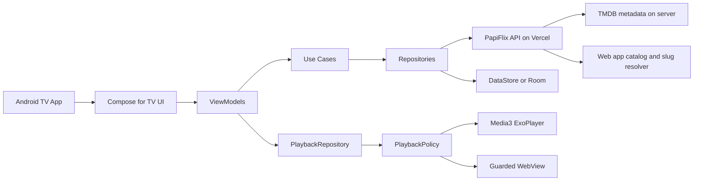
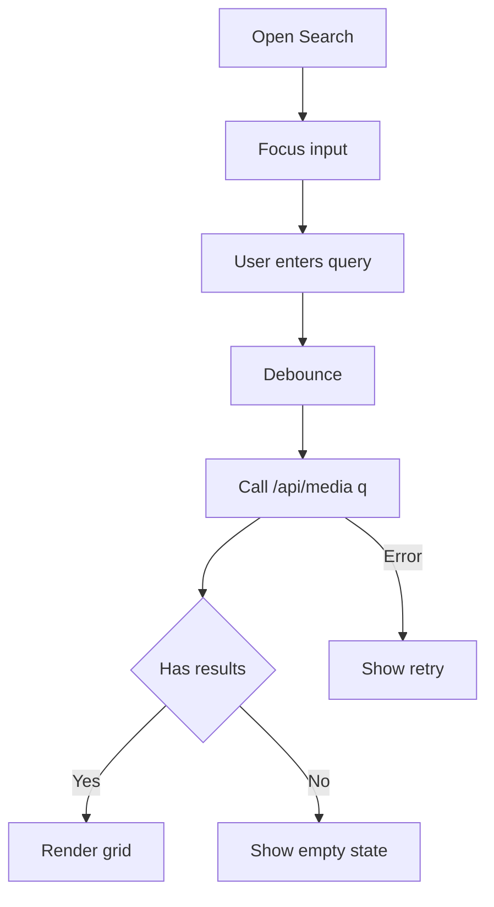
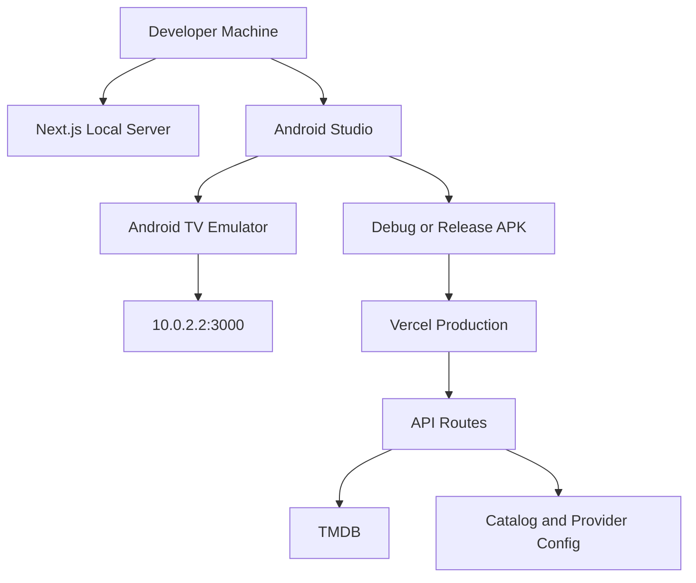

# PapiFlix Android TV Netflix Clone Development Master Plan

This file is the Android Studio TV application blueprint for building a native Netflix-style Android TV client for the Movie-Time / PapiFlix web application.

Repository target: alfagamez22/Movie-Time
Web app name: PapiFlix
Android app name: PapiFlix TV
Primary platform: Android TV and Google TV
Recommended language: Kotlin
Recommended UI: Jetpack Compose for TV
Recommended playback layer: AndroidX Media3 ExoPlayer for authorized direct streams, guarded WebView only for approved official embeds

Important compliance boundary: this plan is only for lawful metadata browsing and authorized playback. Do not implement DRM bypassing, protected stream extraction, hidden token scraping, signature bypassing, CORS bypassing, or unauthorized redistribution. The Android TV app should treat provider playback as configurable adapters that are enabled only when the developer has permission to use the provider source.

---

## 1. Purpose

The goal is to create a native Android Studio TV application that behaves like a Netflix-style 10-foot interface for the existing PapiFlix media catalog. The Android TV app should not simply wrap the deployed website in a full-screen WebView. It should consume the PapiFlix API, render native TV screens, support D-pad focus navigation, and isolate playback behind a safe playback policy.

The application should support:

- Home screen with hero banner and horizontal rails.
- Movie and TV browsing.
- Search with remote-friendly input.
- Detail screen with poster, backdrop, metadata, synopsis, trailer action, favorite action, and play action.
- TV season and episode selection.
- Continue watching.
- Favorites.
- Settings and diagnostics.
- Authorized player integration.
- Local development against localhost or deployed Vercel.
- Build-time configuration using Android local properties.

---

## 2. Current Web Repository Context

The existing repository is a Next.js application named PapiFlix. The web app provides API routes under `app/api/media`, a slug-based watch route under `watch/[slug]`, editable media content under `content/media`, media utilities under `lib/media`, slug helpers under `lib/slugs`, and deployment notes under `infrastructure`.

The Android TV app should use the deployed Vercel app as the backend API first. Direct TMDB calls from Android should be optional and used only for development or fallback because API keys inside APK files are not truly secret. Production metadata hydration should remain server-side when possible.

---

## 3. Existing API Contract

The Android app should consume these PapiFlix routes:

```http
GET /api/media
GET /api/media?type=movie
GET /api/media?type=tv
GET /api/media?q=batman
GET /api/media?q=batman&type=movie
GET /api/media/{slug}
GET /api/media/{tmdb-id}?type=tv
GET /api/media/{slug}?type=movie&id=550
```

Browse and search response pattern:

```json
{
  "data": [],
  "filters": {
    "query": null,
    "type": null
  },
  "mode": "browse",
  "source": "live",
  "total": 36,
  "totalResults": 1000
}
```

Detail response pattern:

```json
{
  "canonicalSlug": "movie-title-550",
  "data": {},
  "matchedBy": "slug",
  "source": "live"
}
```

Minimum media item fields to support:

| API field | Android model field | Usage |
|---|---|---|
| id | id | stable media identifier |
| provider | provider | source badge and routing policy |
| type | type | movie or tv behavior |
| title | title | card, hero, detail title |
| synopsis | synopsis | description text |
| posterUrl | posterUrl | poster card artwork |
| backdropUrl | backdropUrl | hero and detail background |
| rating | rating | rating chip |
| voteCount | voteCount | optional metadata |
| year | year | metadata row |
| maxSeasons | maxSeasons | TV selector |
| maxEpisodes | maxEpisodes | TV selector |
| episodesBySeason | episodesBySeason | per-season episode count |

---

## 4. Environment Template

The user-provided environment values should be treated as a template. Real values must be manually placed in the Android local configuration and must not be committed.

```properties
NEXT_PUBLIC_APP_NAME=PapiFlix
NEXT_PUBLIC_APP_DESCRIPTION=Stream your Favorite Movies and TV Shows for Free
NEXT_PUBLIC_SITE_URL=http://localhost:3000
VIDKING_EMBED_BASE_URL=https://www.vidking.net/embed
ANIWAVE_CDN_ORIGIN=https://megaplay.buzz
ANITAKU_CDN_ORIGIN=https://anitaku.to
YOUTUBE_EMBED_BASE_URL=https://www.youtube.com/embed
YOUTUBE_THUMBNAIL_BASE_URL=https://img.youtube.com/vi
YOUTUBE_WATCH_BASE_URL=https://www.youtube.com/watch
TMDB_API_TOKEN=
TMDB_API_KEY=
```

Recommended Android-specific configuration:

```properties
PAPIFLIX_BASE_URL=https://your-vercel-deployment.vercel.app
NEXT_PUBLIC_APP_NAME=PapiFlix
NEXT_PUBLIC_APP_DESCRIPTION=Stream your Favorite Movies and TV Shows for Free
NEXT_PUBLIC_SITE_URL=https://your-vercel-deployment.vercel.app
VIDKING_EMBED_BASE_URL=https://www.vidking.net/embed
ANIWAVE_CDN_ORIGIN=https://megaplay.buzz
ANITAKU_CDN_ORIGIN=https://anitaku.to
YOUTUBE_EMBED_BASE_URL=https://www.youtube.com/embed
YOUTUBE_THUMBNAIL_BASE_URL=https://img.youtube.com/vi
YOUTUBE_WATCH_BASE_URL=https://www.youtube.com/watch
TMDB_API_TOKEN=
TMDB_API_KEY=
```

Recommended files:

```text
android-tv/local.properties.example
android-tv/secrets.properties.example
android-tv/.gitignore
```

Never commit:

```text
local.properties
secrets.properties
.env
.env.local
.env.tv.local
```

---

## 5. High-Level Architecture



Layer responsibilities:

| Layer | Responsibility |
|---|---|
| UI | Render TV screens and focus states |
| ViewModel | Hold screen state and trigger use cases |
| Use case | Application-specific operations |
| Repository | Remote/local data coordination |
| Remote API | Retrofit/OkHttp calls to PapiFlix |
| Local store | favorites, progress, recent searches |
| Playback policy | legal and technical validation before playback |
| Player | Media3 or guarded WebView |

---

## 6. Recommended Android Stack

Use this stack for a maintainable native TV app:

| Area | Recommendation |
|---|---|
| Language | Kotlin |
| UI | Jetpack Compose for TV |
| Architecture | MVVM plus use cases |
| Async | Coroutines and Flow |
| Network | Retrofit plus OkHttp |
| JSON | Kotlinx Serialization or Moshi |
| Images | Coil |
| Playback | AndroidX Media3 ExoPlayer |
| Local preferences | DataStore |
| Local cache | Room, optional |
| Dependency injection | Hilt or a lightweight manual AppContainer |
| Testing | JUnit, MockWebServer, Compose UI tests |
| CI | GitHub Actions Gradle build and tests |

Avoid a phone-first UI. Android TV requires large readable text, remote-first navigation, focus restoration, and no dependency on touch gestures.

---

## 7. Project Structure

```text
android-tv/
  README.md
  local.properties.example
  settings.gradle.kts
  build.gradle.kts
  gradle/libs.versions.toml
  app/
    build.gradle.kts
    proguard-rules.pro
    src/main/
      AndroidManifest.xml
      java/com/papiflix/tv/
        MainActivity.kt
        PapiFlixTvApp.kt
        core/
          config/AppConfig.kt
          config/ProviderConfig.kt
          di/AppContainer.kt
          network/NetworkModule.kt
          result/AppResult.kt
          util/FocusRestorer.kt
          util/TvLogger.kt
        data/
          remote/PapiFlixApi.kt
          remote/dto/MediaDto.kt
          remote/dto/MediaListResponseDto.kt
          remote/dto/MediaDetailResponseDto.kt
          repository/MediaRepository.kt
          repository/PlaybackRepository.kt
          local/FavoritesStore.kt
          local/WatchProgressStore.kt
          local/SearchHistoryStore.kt
        domain/
          model/MediaItem.kt
          model/MediaDetail.kt
          model/MediaType.kt
          model/MediaProvider.kt
          model/PlaybackSource.kt
          model/Rail.kt
          usecase/GetHomeRailsUseCase.kt
          usecase/SearchMediaUseCase.kt
          usecase/GetMediaDetailUseCase.kt
          usecase/ToggleFavoriteUseCase.kt
        playback/
          PlaybackPolicy.kt
          PlaybackRoute.kt
          ExoPlayerManager.kt
          EmbedWebViewClient.kt
        ui/
          navigation/TvNavGraph.kt
          theme/PapiFlixTheme.kt
          components/PosterCard.kt
          components/MediaRail.kt
          components/HeroBanner.kt
          components/FocusedButton.kt
          components/ErrorState.kt
          components/LoadingState.kt
          screens/home/HomeScreen.kt
          screens/details/DetailsScreen.kt
          screens/search/SearchScreen.kt
          screens/player/PlayerScreen.kt
          screens/settings/SettingsScreen.kt
      res/
        drawable/
        mipmap-anydpi-v26/
        values/
        xml/network_security_config.xml
```

Recommended monorepo layout inside Movie-Time:

```text
Movie-Time/
  app/
  components/
  content/
  lib/
  infrastructure/
  docs/
  android-tv/
    app/
    gradle/
    README.md
```

This keeps the Android client close to the API contract while still allowing independent Gradle builds.

---

## 8. Gradle Configuration Plan

Gradle should load local values from `local.properties` and inject them into `BuildConfig`.

Required BuildConfig fields:

| Field | Purpose |
|---|---|
| PAPIFLIX_BASE_URL | deployed Vercel or local backend URL |
| APP_NAME | display name |
| APP_DESCRIPTION | settings/about text |
| VIDKING_EMBED_BASE_URL | configurable provider base |
| ANIWAVE_CDN_ORIGIN | provider allowlist value |
| ANITAKU_CDN_ORIGIN | provider allowlist value |
| YOUTUBE_EMBED_BASE_URL | trailer embed base |
| YOUTUBE_THUMBNAIL_BASE_URL | trailer thumbnail base |
| YOUTUBE_WATCH_BASE_URL | external YouTube watch base |
| TMDB_API_TOKEN | development fallback only |
| TMDB_API_KEY | development fallback only |

Build variants:

| Variant | Base URL | Use case |
|---|---|---|
| debug | http://10.0.2.2:3000 | Android emulator to local Next.js |
| staging | Vercel preview URL | QA testing |
| release | production Vercel URL | production build |

Security reminder: BuildConfig values are compiled into the APK. Do not treat TMDB keys in Android as secure. Prefer server-side metadata through the PapiFlix API.

---

## 9. Android Manifest Requirements

The app must declare TV support, Internet permission, and the Leanback launcher category.

Required manifest features:

```text
uses-permission android.permission.INTERNET
uses-feature android.software.leanback required true
uses-feature android.hardware.touchscreen required false
activity intent category android.intent.category.LEANBACK_LAUNCHER
application banner asset for TV launcher
```

The app should provide a TV banner, app icon, and theme optimized for dark mode.

---

## 10. Network Layer

Use Retrofit for typed API access. Use OkHttp interceptors for logging only in debug builds.

Recommended API interface:

```kotlin
interface PapiFlixApi {
    suspend fun getMedia(type: String?, query: String?): MediaListResponseDto
    suspend fun getMediaDetail(slug: String, type: String?, preferredTmdbId: String?): MediaDetailResponseDto
}
```

Network rules:

- Use HTTPS in production.
- Allow cleartext only for local development if necessary.
- Use 15 to 30 second timeouts.
- Add retry only for safe idempotent GET requests.
- Return structured error states instead of crashing.
- Never log credentials.
- Never pass arbitrary URLs from API data into WebView without allowlist validation.

---

## 11. Domain Models

Core Android domain models:

```text
MediaItem
  id
  slug
  provider
  type
  title
  synopsis
  posterUrl
  backdropUrl
  rating
  voteCount
  year
  maxSeasons
  maxEpisodes
  episodesBySeason

MediaDetail
  item
  cast
  trailers
  recommendations
  seasons

Rail
  id
  title
  description
  items

PlaybackSource
  mediaId
  mediaType
  provider
  season
  episode
  language
  routeType
  url
  headers
  drmConfig optional authorized only
```

Mapping rules:

- If `posterUrl` is missing, show a branded placeholder.
- If `backdropUrl` is missing, use a gradient background.
- If `rating` is missing, hide the rating chip.
- If `year` is missing, hide the year text.
- If TV episode counts are missing, allow manual selection only when the backend provides safe limits.
- If provider is unknown, disable playback and show a clear unsupported-provider message.

---

## 12. Home Screen Plan

The Home screen is the main Netflix-style surface.

Required sections:

- Hero banner.
- Continue Watching.
- Trending Now.
- Popular Movies.
- Popular TV Shows.
- Filipino Movies if provided by backend.
- Anime if provided by backend.
- Favorites.
- Recently Added or Recommended.

TV focus behavior:

- Every poster card must be focusable.
- Focused cards should scale slightly and show a visible border/glow.
- Horizontal rails must remember their scroll position.
- Returning from Details should restore focus to the selected card.
- Back from Home should ask to exit or use system behavior.

Recommended home state:

```text
HomeUiState
  isLoading
  heroItem
  rails
  focusedItem
  errorMessage
  isRefreshing
```

---

## 13. Details Screen Plan

The Details screen should show:

- Large backdrop.
- Poster.
- Title.
- Year.
- Rating.
- Type badge.
- Provider badge.
- Synopsis.
- Play button.
- Trailer button.
- Add or Remove Favorite button.
- Season selector for TV.
- Episode selector for TV.
- Similar titles rail.

Button order for TV remote:

```text
Play -> Trailer -> Favorite -> More Info or Back
```

For TV series:

- Default season to 1 unless the user has progress.
- Default episode to next unwatched episode when progress exists.
- Disable episodes beyond the backend maximum.
- Show unavailable if the backend cannot verify episode availability.

---

## 14. Search Screen Plan

Search should be remote-friendly. Do not assume keyboard or touch.

Required behavior:

- Search input with D-pad support.
- Debounced API request after text changes.
- Movie, TV, and All filters.
- Recent searches.
- Clear recent searches.
- Empty-state screen.
- Error and retry.

Recommended search flow:



---

## 15. Playback Architecture

Playback must be isolated from UI. The UI asks for a `PlaybackRoute`, and the playback layer decides whether it is playable.

Playback route types:

| Type | Description |
|---|---|
| DirectStream | authorized HLS or MP4 source for Media3 |
| OfficialEmbed | approved provider embed in guarded WebView |
| Trailer | YouTube trailer path |
| Unsupported | blocked or unavailable provider |

Playback policy rules:

- Allow Media3 only for authorized HLS or MP4 URLs.
- Allow WebView only for hosts in the allowlist.
- Block arbitrary redirects.
- Block provider pages that require unsupported controls.
- Do not extract hidden video URLs from embeds.
- Do not bypass DRM or signed URLs.
- Do not inject JavaScript to defeat provider restrictions.
- Fail safely with a visible error.

Suggested allowlist categories:

```text
Configured official embed host
Configured YouTube host
Configured anime provider origin if authorized
PapiFlix own Vercel domain
```

---

## 16. Local Data

Use DataStore for simple key-value records. Use Room if the app grows into a large offline catalog cache.

Local data features:

| Feature | Store | Notes |
|---|---|---|
| Favorites | DataStore or Room | keyed by provider plus type plus id |
| Continue Watching | DataStore or Room | progress seconds and updatedAt |
| Recent Searches | DataStore | max 10 to 20 entries |
| Settings | DataStore | playback preference, cache settings |
| API cache | Room optional | only if needed for offline browsing |

Continue watching record:

```text
WatchProgress
  mediaKey
  title
  posterUrl
  type
  season
  episode
  progressMs
  durationMs
  updatedAt
```

---

## 17. Infrastructure Plan

Infrastructure should keep the Android TV app as a client and the Next.js Vercel app as the API gateway.



Environments:

| Environment | Android URL | Web URL | Notes |
|---|---|---|---|
| Local emulator | http://10.0.2.2:3000 | http://localhost:3000 | debug only |
| Local physical TV | http://LAN-IP:3000 | http://localhost:3000 | same Wi-Fi |
| Staging | Vercel preview | Vercel preview | QA |
| Production | production Vercel | production Vercel | release |

Recommended CI checks:

- Web app: npm install, lint, typecheck, build.
- Android: Gradle assembleDebug, unit tests, lint.
- No secrets scan.
- Optional APK artifact upload for manual TV testing.

---

## 18. Security Checklist

- Real local properties must be ignored.
- Real TMDB token and key must not be committed.
- Do not rely on APK obfuscation for secret protection.
- Prefer server-side TMDB calls through PapiFlix API.
- Use HTTPS in production.
- Use cleartext traffic only in debug for local development.
- Disable verbose network logging in release.
- Add WebView host allowlist.
- Disable arbitrary file access in WebView unless needed.
- Do not save credentials to logs.
- Do not send credentials to crash reports.
- Do not expose raw provider configuration in public UI.

---

## 19. Testing Plan

Unit tests:

- DTO mapping.
- Repository success response.
- Repository empty response.
- Repository error response.
- API URL construction.
- Playback policy allow/deny cases.
- Favorites persistence.
- Watch progress persistence.

Integration tests:

- MockWebServer for `/api/media`.
- MockWebServer for `/api/media/{slug}`.
- Network timeout handling.
- Malformed JSON handling.

TV UI tests:

- Home D-pad navigation.
- Rail focus restoration.
- Details screen button focus.
- Search input focus.
- Player exit behavior.
- Settings navigation.

Manual tests:

- Android TV emulator.
- Google TV device.
- Low-memory device.
- Slow network.
- No network.
- Large catalog response.
- Missing artwork.

---

## 20. Development Roadmap

Phase 0: Web API verification

- Confirm production Vercel base URL.
- Confirm `/api/media` returns data.
- Confirm movie and TV filters.
- Confirm search query.
- Confirm detail endpoint.
- Capture sample JSON fixtures.

Phase 1: Android project bootstrap

- Create Android TV project.
- Add Kotlin and Compose for TV.
- Add TV manifest entries.
- Add banner and launcher assets.
- Add BuildConfig injection.
- Add local properties example.

Phase 2: API and data layer

- Add Retrofit and OkHttp.
- Add DTOs.
- Add domain mappers.
- Add repositories.
- Add result wrappers.
- Add unit tests.

Phase 3: Home and details

- Build hero banner.
- Build poster cards.
- Build media rails.
- Build details screen.
- Build season/episode selectors.
- Add focus restoration.

Phase 4: Search and local state

- Build search screen.
- Add debounce.
- Add filters.
- Add favorites.
- Add recent searches.
- Add continue watching.

Phase 5: Playback

- Add playback policy.
- Add Media3 player screen.
- Add guarded WebView screen.
- Add unsupported-provider states.
- Add watch progress updates.

Phase 6: QA and release

- Add tests.
- Add CI.
- Add release signing instructions.
- Add privacy and legal screens.
- Add Play Store TV assets.
- Validate release APK.

---

## 21. Recommended Coding-Agent Prompt

Use this prompt when asking a coding agent to implement the Android TV app:

```markdown
Build a native Android TV app named PapiFlix TV inside an android-tv folder. Use Kotlin, Jetpack Compose for TV, MVVM, Coroutines, Flow, Retrofit, OkHttp, Coil, DataStore, and AndroidX Media3. The app consumes the existing PapiFlix API from the Movie-Time Next.js repository. Use PAPIFLIX_BASE_URL for the deployed Vercel or local backend URL. Implement Home, Details, Search, Player, and Settings screens with Android TV D-pad focus behavior. Keep real API keys in local.properties or secrets.properties only. Do not commit secrets. Use BuildConfig for non-secret build-time config. Use the PapiFlix API routes /api/media and /api/media/{slug}. Implement playback behind PlaybackPolicy. Only support authorized direct HLS/MP4 streams through Media3 or official allowlisted embeds through guarded WebView. Do not implement DRM bypassing, token extraction, CORS bypassing, protected stream scraping, or unauthorized redistribution. Include loading states, error states, DTO mappers, repository tests, MockWebServer tests, and TV accessibility checks.
```

---

## 22. Final Implementation Recommendation

Start with three production-quality flows before attempting complex playback:

1. Home browse from `/api/media`.
2. Details screen from `/api/media/{slug}`.
3. Search from `/api/media?q=...`.

After those are stable with proper D-pad focus, add playback as a separate module. This keeps the Android TV application maintainable and prevents provider-specific playback concerns from contaminating the UI and catalog architecture.
